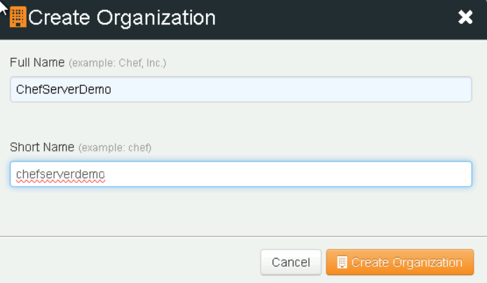
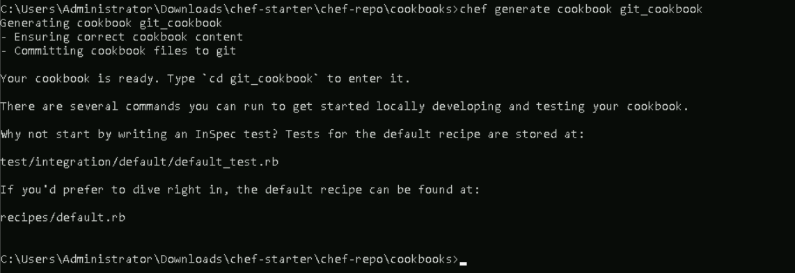
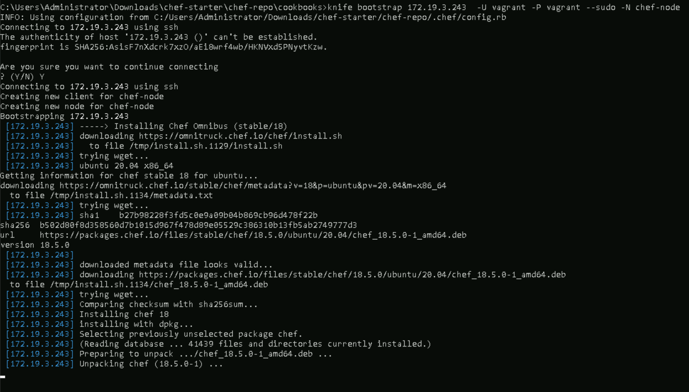

# **Install and Configure Chef Workstation, Chef Server, and a Chef Node**

## **Table of Contents**
---
* [**Description**](#description)  
* [**Problem Statement**](#problem-statement)  
* [**Prerequisites**](#prerequisites)
* [**Implementation Steps**](#implementation-steps) 
  - [**Step-1: Install Chocolatey, Virtual Box and Vagrant**](#step-1-install-chocolatey-virtual-box-and-vagrant) 
  - [**Step-2: Install Chef workstation**](#step-2-install-chef-workstation) 
  - [**Step-3: Create an organization for server setup**](#step-3-create-an-organization-for-server-setup)
  - [**Step-4: Generate your Cookbook**](#step-4-generate-your-cookbook)
  - [**Step-5: Create your Node**](#step-5-create-your-node)
  - [**Step-6: Change the Network Settings**](#step-6-change-the-network-settings)
  - [**Step-7: Connect Server to your Node**](#step-7-connect-server-to-your-node)  
* [**References**](#references)

## **Description**
---
This lab guide provides step-by-step instructions for setting up a Chef ecosystem, including the installation and configuration of Chef Workstation, Chef Server, and a Chef Node. Chef is a powerful tool for automating system configurations, infrastructure management, and application deployments. By the end of this guide, you will have a functional Chef environment ready for configuration management tasks.

## **Problem Statement**
---
Automating configuration management across multiple servers can be challenging without the right tools. Chef provides a streamlined way to define infrastructure as code, making server management efficient, consistent, and scalable. In this lab, we will:
- Install Chef Workstation to manage our Chef configurations.
- Configure Chef Server as the central repository for all Chef configurations.
- Set up Chef Node, which will be managed by Chef Server.

## **Prerequisites**
---
- 64 bit operating system
- CPU Virtualization enabled

In order to virtualize a 64 bit operating system, one must also be running a 64 bit operating system. Most importantly, the CPU itself must support hardware virtualization extensions and this must be enabled in the BIOS/EFI. Most modern processors support virtualization extensions in the form of VT-x (Intel) or AMD-V (AMD).

## **Implementation Steps**
---
### **Step-1: Install Chocolatey, Virtual Box and Vagrant**

**1. Install Chocolatey**

- To install Chocolatey, run the following command from the command line or from PowerShell:

  ```bash 
  Set-ExecutionPolicy Bypass -Scope Process -Force; [System.Net.ServicePointManager]::SecurityProtocol = [System.Net.ServicePointManager]::SecurityProtocol -bor 3072; iex ((New-Object System.Net.WebClient).DownloadString('https://community.chocolatey.org/install.ps1'))
  ```

  

- Verify the installation by running the following command in cmd

  ```bash
  choco --version
  ```

  

**2. Install Virtual Box**

- VirtualBox is a hypervisor that lets you run virtual machines on your local workstation.
- To install Virtual Box, run the following command from the command line or from PowerShell:

  ```bash
  choco install virtualbox
  ```

  

- Verify the installation by running the following command in cmd

  ```bash
  virtualbox --version
  ```
  
**2. Install Vagrant**

- Vagrant manages hypervisors such as VirtualBox and makes it easy to distribute pre-packaged virtual machines, known as “boxes”. 
- To install Vagrant, run the following command from the command line or from PowerShell:

  ```bash
  choco install Vagrant
  ```

  

- Verify the installation by running the following command in cmd

  ```bash
  vagrant --version
  ```

  


### **Step-2: Install Chef workstation**

- To install Chef Workstation, run the following command from the command line or from PowerShell:

```bash
choco install chef-workstation
```


- This package includes Chef Infra Client, Chef InSpec, Test Kitchen, Cookstyle, and a variety of useful tools for the Chef ecosystem.

- Verify the installation by running the following command in cmd

```bash
chef --version
```


### **Step-3: Create an organization for server setup**


**1. Sign Up for Manage Chef**

- Go to [Manage Chef](https://manage.chef.io) in your web browser.
-  Click **Sign Up** or **Get Started**.
-  Enter your email address and follow the on-screen instructions to complete the sign-up process. You may be required to verify your email address.


**2. Log in and Create an Organization**

- Once signed up, log in to [Manage Chef](https://manage.chef.io).
- After logging in, navigate to the **Organizations** section.
- Click on **Create Organization**.
- Provide the required details:
   - **Organization Name**: Choose a name for your organization.
   - **Short Name**: Enter a short, unique identifier for the organization.
- Complete any additional steps to confirm and create the organization.



**3. Download the Starter Kit**

- After creating the organization, navigate to the **Starter Kit** section (usually under your organization settings).
- Click **Download Starter Kit**. The kit includes essential configuration files for Chef, like `knife.rb`, which you’ll need to manage nodes.
- Follow any on-screen prompts to confirm the download.
- Extract the files

The starter kit should now be downloaded to your system, and you can proceed with configuring Chef on your workstation using the kit files.


### **Step-4: Generate your Cookbook**

- cd to chef-start\chef-repo\cookbooks and open command promt

**1. Creating a Cookbook**

- In order to keep our example as simple as possible let's create a chef-infra cookbook to automate the installation and management of the Git distributed version control tool.

- run the following command to generate a cookbook

```bash
chef generate cookbook git_cookbook
```



**2. Configure kitchen.yam File for Node Configuration**

- The `kitchen.yml` file is the main configuration file for **Test Kitchen**. It defines how to set up, run, and destroy instances for testing infrastructure code, primarily used for Chef cookbooks.

- cd to chef-start\chef-repo\cookbooks\git_cookbook

- Edit the `kitchen.yml` file

```yaml
---
driver:
  name: vagrant

provisioner:
  name: chef_infra

verifier:
  name: inspec

platforms:
  - name: ubuntu-20.04

suites:
  - name: default
    verifier:
      inspec_tests:
        - test/integration/default
    attributes:
```


- Run the following command to verify the `kitchen list`

```bash
kitchen list
```


- Configure virtual machine boot timeout

  - cd to C:\Users\Administrator\.vagrant.d\boxes\bento-VAGRANTSLASH-ubuntu-20.04\202407.23.0\amd64\virtualbox
  - Add config.vm.boot_timeout = 600 to the `Vagrantfile`

  


  
  

### **Step-5: Create your Node**

A Test Kitchen **Instance** is a combination of a **Suite** and a **Platform** as laid out in your `kitchen.yml` file. Test Kitchen has auto-named our only instance by combining the **Suite** name (**"default"**) and the **Platform** name (**"ubuntu-20.04"**) into a form that is safe for DNS and hostname records, namely **"default-ubuntu-2004"**.

Let’s spin this **Instance** up to see what happens. We’re going to be explicit and ask kitchen to only create the **default-ubuntu-2004** instance:

```bash 
kitchen create default-ubuntu-2004
```


**1. Setup Node**

- Run the following command to login to your Node

  ```bash
  kitchen login
  ```
  

- Run the following command to open the sudoers file safely

  ```bash
  sudo visudo
  ```

  

- Add the following at the end of sudoers file and `ctrl+x` to safely exit the file

  ```bash
  vagrant  ALL=(ALL) NOPASSWD:ALL
  ```

  

### **Step-6: Change the Network Settings**

- Open your Virtual box and click on `Network`


- Change the Network settings from Attached to:`NAT` to Attached to:`Bridged Adapter`


- Change the Promiscuous Mode: `Allow All` and click on `ok`


- Reboot your Node by stopping the system in virtual box and starting it again

- Once the system is Running, click on Show and login to your system with the following credetials

  - username- vagrant
  - password- vagrant

  

- Run the folllowing command to install net-tools

```bash 
sudo apt install net-tools
```


- Check the ipconfig of your Node and Note down the etho2 ip: inet <ipaddress>

```bash
ip a
```


### **Step-7: Connect Server to your Node**

Run the following command to connect server to your node
>Note: Replace the ip address in the command with your respective ip address

```bash
knife bootstrap 172.19.4.155 -U vagrant -P vagrant --sudo -N chef-node
```



- Verify your node

  1. Go to [Manage Chef](https://manage.chef.io) in your web browser.
  2. Click on your **Organization**.
  3. Click n **Nodes**.

  

## **References**
---
- Official Chef Documentation: [https://docs.chef.io/](https://docs.chef.io/)
- Setting Up Chef Server: [https://docs.chef.io/server/](https://docs.chef.io/server/)
- Working with Chef Workstation: [https://docs.chef.io/workstation/](https://docs.chef.io/workstation/)
- Chef Infra Client Overview: [https://docs.chef.io/chef_client_overview/](https://docs.chef.io/chef_client_overview/)


