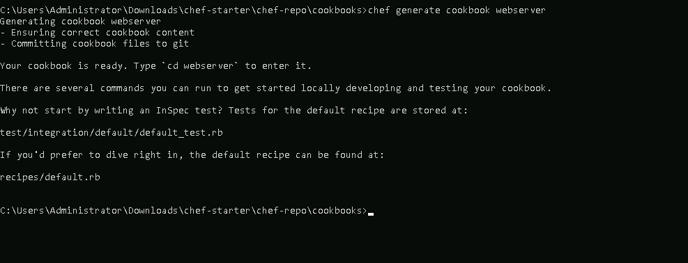
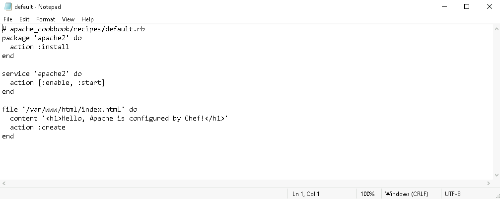
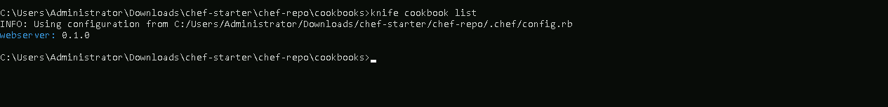
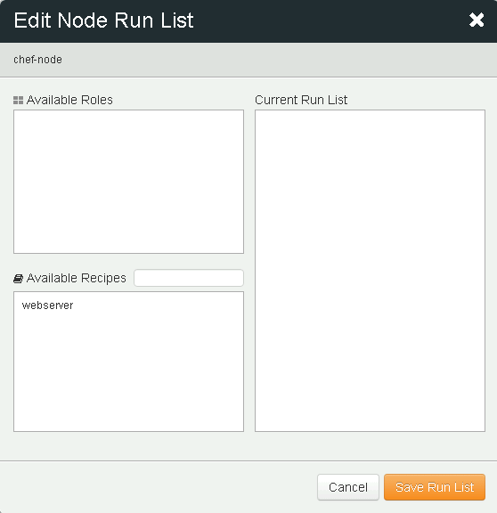
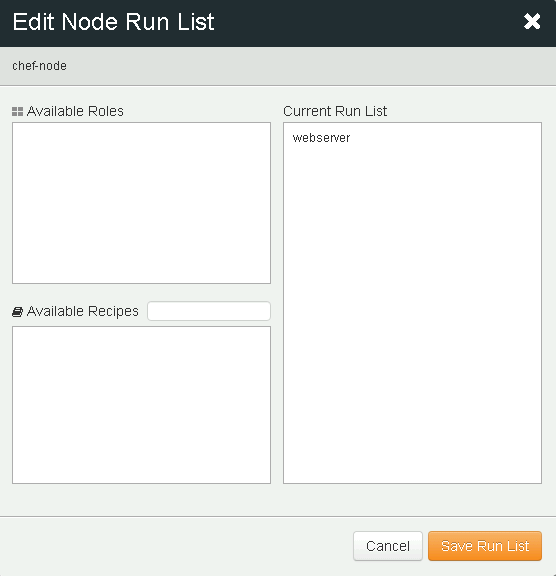

# **Write and Deploy a Basic Chef Recipe to Configure a Web Server**

## **Table of Contents**
---
* [**Description**](#description)  
* [**Problem Statement**](#problem-statement)  
* [**Prerequisites**](#prerequisites)
* [**Implementation Steps**](#implementation-steps) 
  - [**Step-1: Create a Chef Recipe**](#step-1-create-a-chef-recipe) 
  - [**Step-2: Write the Recipe to Install and Configure Apache**](#step-2-write-the-recipe-to-install-and-configure-apache) 
  - [**Step-3: Upload the Recipe to Chef Server**](#step-3-upload-the-recipe-to-chef-server)
  - [**Step-4: Run the Recipe on Chef Node**](#step-4-run-the-recipe-on-chef-node) 
* [**References**](#references)

## **Description**
---
This guide provides a step-by-step process to write and deploy a simple Chef recipe that installs and configures an Apache web server on a Chef Node. By the end of this lab, you will have a functional Apache server running on a Chef-managed node.

## **Problem Statement**
---
Setting up and configuring web servers manually on each server can be time-consuming. Chef helps automate this process with recipes that define the configurations for the servers in code. This guide will:
- Create a basic Chef recipe to install Apache.
- Configure Apache to serve a basic web page.
- Deploy the recipe from Chef Server to a Chef Node.

## **Prerequisites**
---
### **Software Required**
- **Chef Workstation**: To write and test Chef recipes.
- **Chef Server**: To host and distribute Chef configurations.
- **Chef Node**: A target machine where Apache will be installed and configured.

## **Hardware Requirement**
- **Chef Workstation**: 2 GB RAM, 2 CPU cores
- **Chef Server**: 4 GB RAM, 2 CPU cores
- **Chef Node**: 2 GB RAM, 1 CPU core (can be a cloud VM or a local machine)


## **Implementation Steps**
---
### **Step-1: Create a Chef Recipe**

1. **Navigate to the Cookbooks Directory**:
   - From your Chef Workstation terminal, navigate to the `chef-repo/cookbooks` directory:
     ```bash
     cd ~/chef-repo/cookbooks
     ```

2. **Generate a New Cookbook**:
   - Create a new cookbook called `webserver`:
     ```bash
     chef generate cookbook webserver
     ```

    

3. **Navigate to the Cookbook Directory**:
   - Move into the `webserver` directory:
     ```bash
     cd webserver
     ```

     

### **Step-2: Write the Recipe to Install and Configure Apache**

1. **Edit the Default Recipe**:
   - Open the `recipes/default.rb` file for editing:
     ```bash
     notepad recipes/default.rb
     ```

     

2. **Add Code to Install Apache and Configure the Home Page**:
   - Write a basic recipe to install and start Apache, and serve a simple webpage:

     ```ruby
     # recipes/default.rb

     package 'apache2' do
       action :install
     end

     service 'apache2' do
       action [:enable, :start]
     end

     file '/var/www/html/index.html' do
       content '<h1>Welcome to Chef-managed Web Server!</h1>'
       action :create
     end
     ```

   - This code does the following:
     - Installs the Apache package.
     - Enables and starts the Apache service.
     - Creates a basic HTML page at `/var/www/html/index.html`.

     

3. **Save and Close the File**.

### **Step-3: Upload the Recipe to Chef Server**

1. **Upload the Cookbook to Chef Server**:
   - From the `chef-repo` directory, use `knife` to upload the cookbook:
     ```bash
     knife cookbook upload webserver
     ```

2. **Verify the Cookbook is Uploaded**:
   - Check on Chef Server if the `webserver` cookbook appears in the list:
     ```bash
     knife cookbook list
     ```

     

### **Step-4: Run the Recipe on Chef Node**

1. **Assign the Recipe to the Node**:
   - Run the following command to add the `webserver` recipe to the node’s run-list:
     ```bash
     knife node run_list add <node_name> 'recipe[webserver]'
     ```

     

    - You can also manually add the `webserver` to the run list by following the below steps

      1. - Go to [Manage Chef](https://manage.chef.io) in your web browser.
      2. Click on settings and edit Run List
      
      

      3. Drag and drop `webserver` to the Current Run List

      

      

      4. Click on Save Run List

2. **Execute the Recipe on the Node**:
   - SSH into your Chef Node, and run `chef-client` to apply the recipe:
     ```bash
     sudo chef-client
     ```

    

     

3. **Verify Apache Web Server**:
   - Open a web browser and navigate to `http://<node-ip>`. You should see the message:
     ```
     Hello, Apache is configured by Chef!
     ```

     

## **References**

- Chef Documentation: [https://docs.chef.io/](https://docs.chef.io/)
- Managing Cookbooks with Chef: [https://docs.chef.io/cookbooks/](https://docs.chef.io/cookbooks/)
- Configuring a Web Server with Chef: [https://learn.chef.io/](https://learn.chef.io/)
