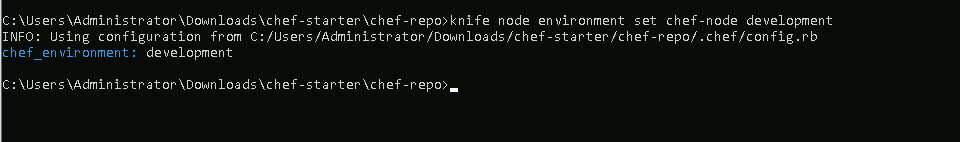

# **Using Chef Roles to Define and Assign Configurations to Different Environments**

## **Table of Contents**
---
* [**Description**](#description)  
* [**Problem Statement**](#problem-statement)  
* [**Prerequisites**](#prerequisites)
* [**Implementation Steps**](#implementation-steps) 
  - [**Step-1: Create a Chef Role**](#step-1-create-a-chef-role) 
  - [**Step-2: Define Configurations for Different Environments**](#step-2-define-configurations-for-different-environments) 
  - [**Step-3: Assign Roles to Nodes**](#step-3-assign-roles-to-nodes) 
* [**References**](#references)

## **Description**
---
This guide covers how to use **Chef Roles** to define configurations based on different environments. Roles in Chef provide an easy way to set configuration attributes for nodes, helping manage environments like **Development**, **Staging**, and **Production** with reusable configurations.

## **Problem Statement**
---
When managing servers across different environments, it’s essential to ensure that each environment is configured according to its specific requirements. Using Chef roles, we can define and group environment-specific settings and apply them to nodes easily.

## **Prerequisites**
---
### **Software Required**
- **Chef Workstation**: To create and manage roles.
- **Chef Server**: To store and manage roles and node configurations.
- **Chef Node(s)**: Target machines where roles will be assigned.

### **Hardware Requirement**
- **Chef Workstation**: 2 GB RAM, 2 CPU cores
- **Chef Server**: 4 GB RAM, 2 CPU cores
- **Chef Node(s)**: 2 GB RAM, 1 CPU core

## **Implementation Steps**
---
### **Step-1: Create a Chef Role**

1. **Navigate to the Roles Directory**:
   - From your Chef Workstation, go to the `chef-repo/roles` directory:
     ```bash
     cd ~/chef-repo/roles
     ```

2. **Create a Role File**:
   - Create a new file using VScode or any other IDE called `webserver_dev.json` for the Development environment role:
     ```json
     {
       "name": "webserver_dev",
       "description": "Role for configuring web servers in the Development environment",
       "run_list": [
         "recipe[webserver]"
       ],
       "default_attributes": {
         "apache": {
           "port": "8080"
         }
       },
       "env_run_lists": {
         "development": [
           "recipe[webserver::dev]"
         ],
         "staging": [
           "recipe[webserver::staging]"
         ],
         "production": [
           "recipe[webserver::production]"
         ]
       }
     }
     ```

   - This JSON file:
     - Defines the `webserver_dev` role with a description.
     - Specifies the `webserver` recipe in the run list.
     - Sets environment-specific configurations in the `env_run_lists` section, specifying different recipes for each environment.

     

3. **Save the Role**.

### **Step-2: Define Configurations for Different Environments**

1. **Create Environment Files**:
   - Go to the `environments` directory in `chef-repo`, and create files for each environment, for example, `development.json`:
   
     ```json
     {
       "name": "development",
       "description": "Development environment configuration",
       "cookbook_versions": {
         "webserver": ">= 0.0.0"
       },
       "default_attributes": {
         "apache": {
           "port": "8080"
         }
       }
     }
     ```

2. **Upload the Environment Configuration**:

   - open cmd from the environments folder
   - Upload each environment file to the Chef Server:
     ```bash
     knife environment from file development.json
     ```

     

### **Step-3: Assign Roles to Nodes**

>Note: cd to roles


1. **Assign a Role to a Node**:
   - Use the `knife` command to assign the `webserver_dev` role to a specific node in the **Development** environment:
     ```bash
     knife node run_list add <node_name> "role[webserver_dev]"
     ```

     

2. **Set the Environment for the Node**:
   - Assign the environment to the node to ensure it picks up environment-specific settings:
     ```bash
     knife node environment set <node_name> development
     ```

     

3. **Run Chef Client on the Node**:
   - Login into the node, and run the Chef client to apply the assigned role and environment configurations:
     ```bash
     sudo chef-client
     ```

     


   - The node will configure itself according to the `webserver_dev` role and the `development` environment settings, including using port `8080` as defined.

## **References**
---
- Chef Documentation: [https://docs.chef.io/](https://docs.chef.io/)
- Managing Roles with Chef: [https://docs.chef.io/roles/](https://docs.chef.io/roles/)
- Environments in Chef: [https://docs.chef.io/environments/](https://docs.chef.io/environments/)
