# **Managing Data Bags to Store Configuration Data and Sensitive Information**

## **Table of Contents**
---
* [**Description**](#description)  
* [**Problem Statement**](#problem-statement)  
* [**Prerequisites**](#prerequisites)
* [**Implementation Steps**](#implementation-steps) 
  - [**Step-1: Create a Data Bag**](#step-1-create-a-data-bag) 
  - [**Step-2: Add Items to a Data Bag**](#step-2-add-items-to-a-data-bag) 
  - [**Step-3: Access Data Bag Items in a Recipe**](#step-3-access-data-bag-items-in-a-recipe)
  - [**Step-4: Encrypt Sensitive Data in Data Bags**](#step-4-encrypt-sensitive-data-in-data-bags) 
* [**References**](#references)

## **Description**
---
Chef **Data Bags** are secure key-value stores for sensitive or configuration data, such as user credentials, API keys, and environment settings. This guide explains how to create and manage data bags, retrieve data in recipes, and secure sensitive information by encrypting data bags.

## **Problem Statement**
---
Storing sensitive data directly in recipes or roles can expose it to unauthorized access. **Data Bags** allow secure storage of this information in a way that can be selectively accessed by specific nodes or roles.

## **Prerequisites**
---
Completion of all previous lab guides (up to Lab Guide-03) is required before proceeding with Lab Guide-04.

### **Software Required**
- **Chef Workstation**: To create and manage data bags.
- **Chef Server**: To store and secure data bags.

### **Hardware Requirement**
- Minimum 2 GB RAM and 2 CPU cores for the Chef Workstation.
- Chef Server with 4 GB RAM and 2 CPU cores.

## **Implementation Steps**
---
### **Step-1: Create a Data Bag**

Data bags are containers for items, and each item holds a specific set of data.

1. **Navigate to the Data Bags Directory**:

   - cd to chef-repo and create a folder as shown below

     ```bash
     mkdir databags\credentials
     ```

     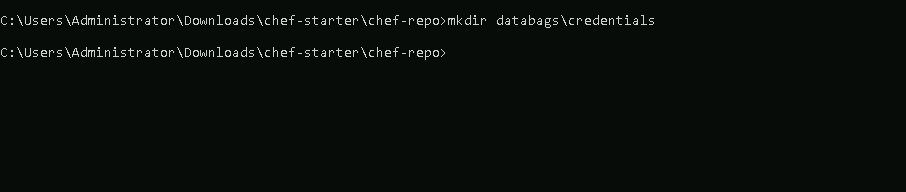

   - Go to your Chef repository:

     ```bash
     cd databags
     ```

2. **Create a Data Bag**:

   - Use `knife` to create a data bag named `credentials`:

     ```bash
     knife data bag create credentials
     ```

     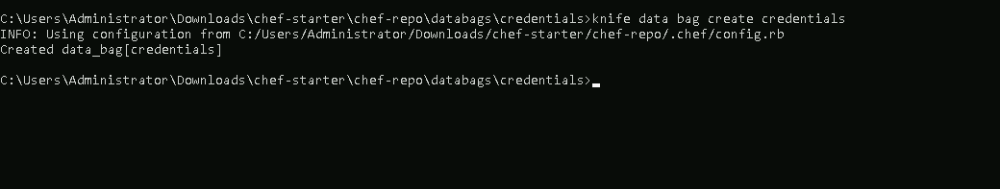

   - This creates a data bag called `credentials` to store sensitive data.

### **Step-2: Add Items to a Data Bag**

Each item within a data bag is a JSON file containing key-value pairs.

1. **Create a Data Bag Item File**:

   - cd to the `credentials` data bag directory:

     ```bash
     cd credentials
     ```

   - Create a JSON file for a secret using VScode or any other IDE, e.g., `web_server.json` using command `code web_server.json`:

     ```json
     {
       "id": "webserver",
       "username": "admin",
       "password": "super_secure_password"
     }
     ```

     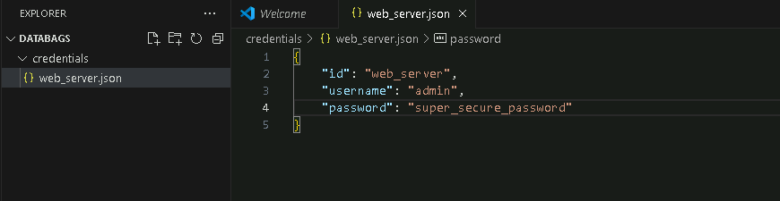

2. **Upload the Data Bag Item**:

   - Upload the item to the Chef Server using `knife` from the `credentials` data bag directory:

     ```bash
     knife data bag from file credentials web_server.json
     ```

     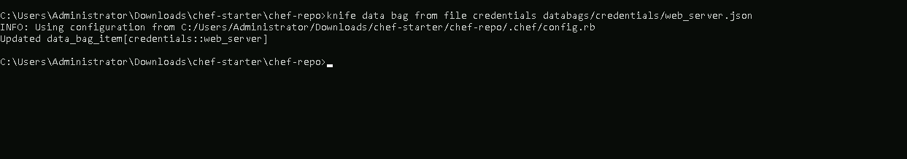

   - This stores the item `web_server.json` inside the `credentials` data bag.

### **Step-3: Access Data Bag Items in a Recipe**

1. **Retrieve Data Bag Data in a Recipe**:  

  - Use the `data_bag_item` method in your recipe to access stored values.

  - Here is an example of how you can configure your recipes to access the `web_server` data bag item:

  - In your cookbook's recipe file, you can retrieve the `username` and `password` from the `web_server` data bag item:

     ```ruby
     package 'apache2' do
       action :install
     end
     
     service 'apache2' do
       action [:enable, :start]
     end
     
     file '/var/www/html/index.html' do
       content '<h1>Welcome to Chef-managed Web Server!</h1>'
       action :create
     end
     
     # Add the data bag item
     secrets = data_bag_item('credentials', 'web_server')
     
     user secrets['username'] do
       password secrets['password']
       action :create
     end
     ```

   - Here:
     - `secrets` retrieves the `username` and `password` for user creation from the `credentials` data bag item.
     - The `user` resource uses these credentials to create the user on the system.

    - This way, you can securely store and access sensitive data in your Chef recipes.

2. **Update the Node's run-list with the recipe**

    ```bash
    knife node run_list add <node_name> 'recipe[webserver::DEV]'
    ```

    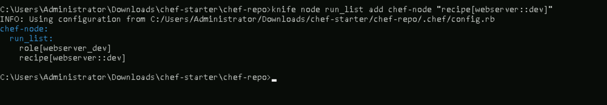

3. **Run the Recipe on the Node**

    ```bash
    chef-client
    ```

    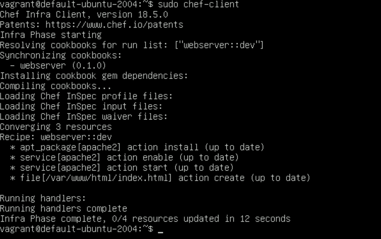

### **Step-4: Encrypt Sensitive Data in Data Bags**

For highly sensitive information, encrypting data bags adds another layer of security.

1. **Create a Secret Key**:  

   - Generate an encryption key file on Windows powershell:  

     ```powershell
     $bytes = New-Object byte[] 64
     (New-Object System.Security.Cryptography.RNGCryptoServiceProvider).GetBytes($bytes)
     [Convert]::ToBase64String($bytes) | Out-File -FilePath C:\Users\Administrator\Downloads\chef-starter\chef-repo\encrypted_data_bag_secret -Encoding UTF8
     ```

     

2. **Encrypt the Data Bag Item**: 

   - Encrypt the `db_password` data bag item: 

     ```bash
     knife data bag from file credentials web_server.json --secret-file C:\Users\Administrator\Downloads\chef-starter\chef-repo\encrypted_data_bag_secret
     ```

     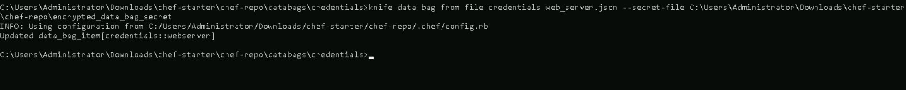

3. **View Encrypted Data Bag**:  

   - If you try to view the encrypted data without the secret file, it will remain encrypted:  

     ```bash
     knife data bag show credentials webserver
     ```

     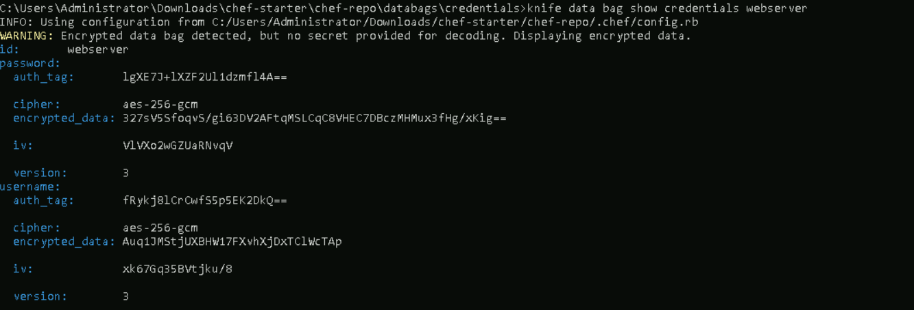

   - To view the decrypted data, specify the secret file:  

     ```bash
     knife data bag show credentials webserver --secret-file C:\Users\Administrator\Downloads\chef-starter\chef-repo\encrypted_data_bag_secret
     ```

     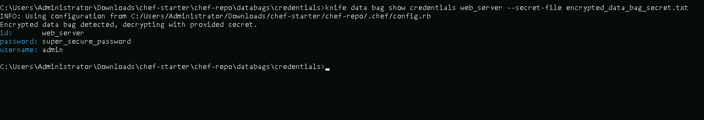

4. **Access Encrypted Data Bag in Recipes**:  

   - Specify the secret key file to access encrypted data:  

     ```ruby
     package 'apache2' do
       action :install
     end
     
     service 'apache2' do
       action [:enable, :start]
     end
     
     file '/var/www/html/index.html' do
       content '<h1>Welcome to Chef-managed Web Server!</h1>'
       action :create
     end

     db_creds = data_bag_item('secrets', 'db_password', IO.read('C:/Users/Administrator/Downloads/chef-starter/chef-repo/encrypted_data_bag_secret'))
     
     user db_creds['username'] do
       password db_creds['password']
       action :create
     end
     ```

      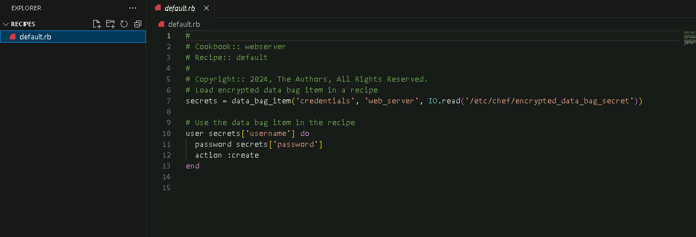

   - Update the node's run-list with key file:

     ```bash
     knife node run_list add <node_name> 'recipe[webserver::DEV]'
     ```

      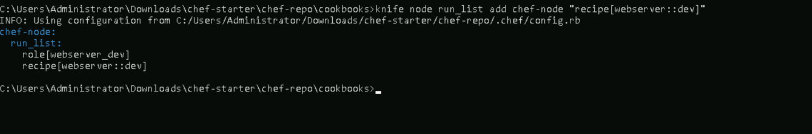

   - Run the recipe on the node:

      ```bash
      chef-client
      ```
  
      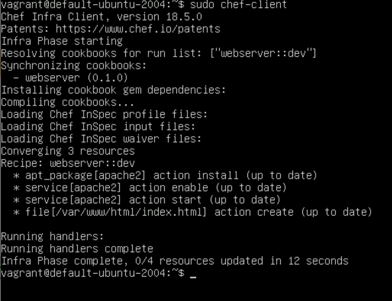   


5. **Distribute the Secret Key Securely**:

   - Ensure the key file is accessible only to authorized users or scripts running Chef recipes.

---

## **References**
---
- Chef Documentation: [https://docs.chef.io/](https://docs.chef.io/)
- Chef Data Bags: [https://docs.chef.io/data_bags/](https://docs.chef.io/data_bags/)
- Encrypting Data Bags: [https://docs.chef.io/data_bags/#encrypt-a-data-bag](https://docs.chef.io/data_bags/#encrypt-a-data-bag)
