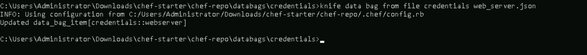
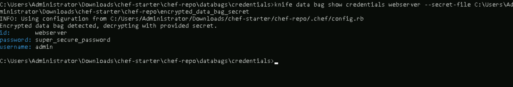

# **Managing Data Bags to Store Configuration Data and Sensitive Information**

## **Table of Contents**
---
* [**Description**](#description)  
* [**Problem Statement**](#problem-statement)  
* [**Prerequisites**](#prerequisites)
* [**Implementation Steps**](#implementation-steps) 
  - [**Step-1: Create a Data Bag**](#step-1-create-a-data-bag) 
  - [**Step-2: Add Items to a Data Bag**](#step-2-add-items-to-a-data-bag) 
  - [**Step-3: Access Data Bag Items in a Recipe**](#step-3-access-data-bag-items-in-a-recipe)
  - [**Step-4: Encrypt Sensitive Data in Data Bags**](#step-4-encrypt-sensitive-data-in-data-bags) 
* [**References**](#references)

## **Description**
---
Chef **Data Bags** are secure key-value stores for sensitive or configuration data, such as user credentials, API keys, and environment settings. This guide explains how to create and manage data bags, retrieve data in recipes, and secure sensitive information by encrypting data bags.

## **Problem Statement**
---
Storing sensitive data directly in recipes or roles can expose it to unauthorized access. **Data Bags** allow secure storage of this information in a way that can be selectively accessed by specific nodes or roles.

## **Prerequisites**
---
### **Software Required**
- **Chef Workstation**: To create and manage data bags.
- **Chef Server**: To store and secure data bags.

### **Hardware Requirement**
- Minimum 2 GB RAM and 2 CPU cores for the Chef Workstation.
- Chef Server with 4 GB RAM and 2 CPU cores.

## **Implementation Steps**
---
### **Step-1: Create a Data Bag**

Data bags are containers for items, and each item holds a specific set of data.

1. **Navigate to the Data Bags Directory**:
   - cd to chef-repo and create a folder as shown below
     ```bash
     mkdir data_bag\credentials
     ```
     

   - Go to your Chef repository:
     ```bash
     cd ~/chef-repo/data_bags
     ```

2. **Create a Data Bag**:
   - Use `knife` to create a data bag named `credentials`:
     ```bash
     knife data bag create credentials
     ```

     

   - This creates a data bag called `credentials` to store sensitive data.

### **Step-2: Add Items to a Data Bag**

Each item within a data bag is a JSON file containing key-value pairs.

1. **Create a Data Bag Item File**:
   - cd to /chef-repo/data_bags/credentials
   - Create a JSON file for a secret using VScode or any other IDE, for example, `web_server.json`:
     ```json
     {
       "id": "webserver",
       "username": "admin",
       "password": "super_secure_password"
     }
     ```

     

2. **Upload the Data Bag Item**:
   - Upload the item to the Chef Server:
     ```bash
     knife data bag from file credentials web_server.json
     ```

     

   - This stores the item `web_server.json` inside the `credentials` data bag.

### **Step-3: Access Data Bag Items in a Recipe**

1. **Retrieve Data Bag Data in a Recipe**:  
   - Use the `data_bag_item` method in your recipe to access stored values.  
   - For example, in a `user_management` recipe:  
     ```ruby
     secrets = data_bag_item('credentials', 'web_server')

     user secrets['username'] do
       password secrets['password']
       action :create
     end
     ```

   - Here:
     - `secrets` retrieves the `username` and `password` for user creation from the `user_credentials` data bag item.
     - The `user` resource uses these credentials to create the user on the system.


### **Step-4: Encrypt Sensitive Data in Data Bags**

For highly sensitive information, encrypting data bags adds another layer of security.

1. **Create a Secret Key**:  
   - Generate an encryption key file on Windows powershell:  

     ```powershell
     $bytes = New-Object byte[] 64
     (New-Object System.Security.Cryptography.RNGCryptoServiceProvider).GetBytes($bytes)
     [Convert]::ToBase64String($bytes) | Out-File -FilePath C:\Users\Administrator\Downloads\chef-starter\chef-repo\encrypted_data_bag_secret -Encoding UTF8
     ```

     

2. **Encrypt the Data Bag Item**:  
   - Encrypt the `db_password` data bag item:  
     ```bash
     knife data bag from file secrets db_password.json --secret-file C:\Users\Administrator\Downloads\chef-starter\chef-repo\encrypted_data_bag_secret
     ```

     

3. **View Encrypted Data Bag**:  
   - If you try to view the encrypted data without the secret file, it will remain encrypted:  
     ```bash
     knife data bag show credentials web_server
     ```
     

   - To view the decrypted data, specify the secret file:  
     ```bash
     knife data bag show credentials web_server --secret-file C:\Users\Administrator\Downloads\chef-starter\chef-repo\encrypted_data_bag_secret
     ```
     

4. **Access Encrypted Data Bag in Recipes**:  
   - Specify the secret key file to access encrypted data:  
     ```ruby
     db_creds = data_bag_item('secrets', 'db_password', IO.read('C:/Users/Administrator/Downloads/chef-starter/chef-repo/encrypted_data_bag_secret'))
     
     user db_creds['username'] do
       password db_creds['password']
       action :create
     end
     ```
      

5. **Distribute the Secret Key Securely**:
   - Ensure the key file is accessible only to authorized users or scripts running Chef recipes.

---

## **References**
---
- Chef Documentation: [https://docs.chef.io/](https://docs.chef.io/)
- Chef Data Bags: [https://docs.chef.io/data_bags/](https://docs.chef.io/data_bags/)
- Encrypting Data Bags: [https://docs.chef.io/data_bags/#encrypt-a-data-bag](https://docs.chef.io/data_bags/#encrypt-a-data-bag)
