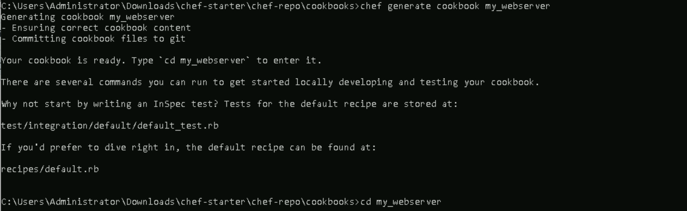
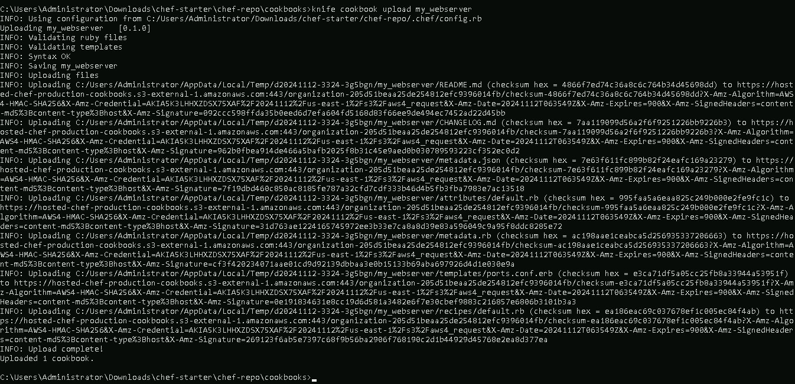
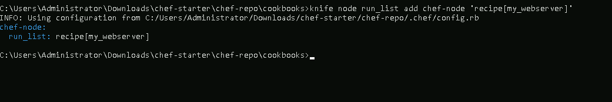

# **Creating and Using Chef Cookbooks for Complex Configurations**

## **Table of Contents**
---
* [**Description**](#description)  
* [**Problem Statement**](#problem-statement)  
* [**Prerequisites**](#prerequisites)
* [**Implementation Steps**](#implementation-steps) 
  - [**Step-1: Create a Chef Cookbook**](#step-1-create-a-chef-cookbook) 
  - [**Step-2: Define Recipes for Complex Configurations**](#step-2-define-recipes-for-complex-configurations) 
  - [**Step-3: Use Attributes to Parameterize Configurations**](#step-3-use-attributes-to-parameterize-configurations) 
  - [**Step-4: Test and Deploy the Cookbook**](#step-4-test-and-deploy-the-cookbook)
* [**References**](#references)

## **Description**
---
Chef **Cookbooks** are collections of recipes and configurations used to manage infrastructure and application setups across multiple environments. This guide details the process of creating a cookbook, defining complex configurations using recipes and attributes, and deploying it on Chef-managed nodes.

## **Problem Statement**
---
When managing complex environments with multiple configuration requirements, it’s essential to use **cookbooks** to organize reusable, modular recipes. By leveraging Chef cookbooks, you can:
- **Centralize configuration management** for various environments.
- **Reuse and version configurations** to avoid redundant coding.
- **Parameterize configurations** to handle varying requirements across different nodes.

## **Prerequisites**
---
### **Software Required**
- **Chef Workstation**: To create and manage cookbooks.
- **Chef Server**: To store and distribute cookbooks to nodes.
- **Chef Node**: To apply and execute cookbooks.

### **Hardware Requirement**
- **Chef Workstation**: 2 GB RAM, 2 CPU cores
- **Chef Server**: 4 GB RAM, 2 CPU cores
- **Chef Node(s)**: 2 GB RAM, 1 CPU core

## **Implementation Steps**
---
### **Step-1: Create a Chef Cookbook**

1. **Generate a Cookbook**:
   - From your Chef Workstation, use the `chef generate cookbook` command to create a new cookbook.
     ```bash
     chef generate cookbook my_webserver
     ```

     

   - This command creates a folder named `my_webserver` with default files and folders, including recipes, attributes, libraries, and tests.

2. **Navigate to the Cookbook Directory**:
   ```bash
   cd my_webserver
   ```

3. **Organize the Folder Structure**:
   - Use the `recipes` directory for configuration tasks, `attributes` for parameter values, and `templates` for any dynamic files you need for configuration.

   

### **Step-2: Define Recipes for Complex Configurations**

1. **Create a Recipe to Install Web Server**:
   - Add a recipe to install and configure a web server in `recipes/default.rb`:
    ```ruby
    # recipes/default.rb
    package 'apache2' do
        action :install
    end

    service 'apache2' do
        action [:enable, :start]
    end

    # Use a template for ports configuration, passing the port attribute
    template '/etc/apache2/ports.conf' do
        source 'ports.conf.erb'  # Make sure this file exists in your templates folder
        variables(port: node['my_webserver']['port'])
    end

    file '/var/www/html/index.html' do
        content '<h1>Welcome to my Chef-configured web server!</h1>'
        action :create
    end
     ```

    

### **Step-3: Use Attributes to Parameterize Configurations**

1. **Define Attributes**:
   - Attributes are the key components for dynamically configuring cookbooks. Attributes enable the authors to make the cookbook configurable. By overriding default values set in cookbooks, the user can inject their own values.
   - Set default values for parameters in the `attributes/default.rb` file. For example, to define the web server’s port:

     ```ruby
     default['my_webserver']['port'] = 80
     ```

     

2. **Use Attributes in Recipes**:
   - Reference these attributes in your recipes to parameterize configurations:
     ```ruby
     template '/etc/apache2/ports.conf' do
       source 'ports.conf.erb'
       variables(port: node['my_webserver']['port'])
     end
     ```

     

3. **Override Attributes for Different Environments**:
   - In production or other environments, you can override attributes by setting values in environment-specific files or roles, allowing you to manage configurations across environments.

### **Step-4: Test and Deploy the Cookbook**

1. **Upload the Cookbook to Chef Server**:
   - Use `knife` to upload the cookbook to the Chef Server:
     ```bash
     knife cookbook upload my_webserver
     ```

     

2. **Run the Cookbook on a Node**:
   - Add the cookbook to a node’s `run list` to apply it:
     ```bash
     knife node run_list add NODE_NAME 'recipe[my_webserver]'
     ```

     

3. **Verify the Configuration**:
   - Log into the Chef Node to ensure that the configurations have been applied and that the services (like Apache) are running with the expected settings.

   ```bash
   sudo chef-client
   ```
   

   - In order to verify the configurations running on port:80, run the following command

   ```bash
   curl localhost:80
   ```

   

## **References**
---
- Chef Documentation: [https://docs.chef.io/](https://docs.chef.io/)
- Creating Chef Cookbooks: [https://docs.chef.io/cookbooks/](https://docs.chef.io/cookbooks/)
- Using Attributes in Chef: [https://docs.chef.io/attributes/](https://docs.chef.io/attributes/)
