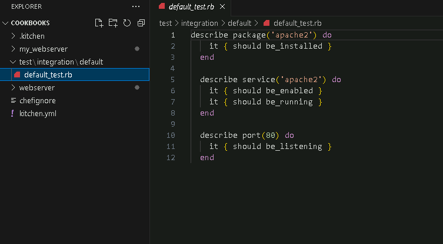

# **Implementing Chef Testing Framework with Test Kitchen and InSpec**

## **Table of Contents**
---
* [**Description**](#description)  
* [**Problem Statement**](#problem-statement)  
* [**Prerequisites**](#prerequisites)
* [**Implementation Steps**](#implementation-steps) 
  - [**Step-1: Install Test Kitchen and InSpec**](#step-1-install-test-kitchen-and-inspec) 
  - [**Step-2: Configure Test Kitchen**](#step-2-configure-test-kitchen) 
  - [**Step-3: Write InSpec Tests for the Cookbook**](#step-3-write-inspec-tests-for-the-cookbook) 
  - [**Step-4: Run Tests with Test Kitchen**](#step-4-run-tests-with-test-kitchen)
* [**References**](#references)

## **Description**
---
Chef’s **Test Kitchen** and **InSpec** are used to test and verify cookbooks in isolated environments, helping ensure that code functions as intended before it’s deployed in production. **Test Kitchen** manages testing environments and runs configurations, while **InSpec** is used to write tests that validate infrastructure settings.

## **Problem Statement**
---
Testing Chef cookbooks in real environments can be time-consuming and error-prone. With Test Kitchen and InSpec, you can:
- **Isolate tests** in separate environments.
- **Automate verification** of expected configurations and services.
- **Ensure code consistency** across multiple systems.

## **Prerequisites**
---
### **Software Required**
- **Chef Workstation**: To create, test, and manage cookbooks.
- **Virtualization Software**: Vagrant or Docker for local testing (recommended).

## **Hardware Requirement**
- **Chef Workstation**: 2 GB RAM, 2 CPU cores

## **Implementation Steps**
---
### **Step-1: Install Test Kitchen and InSpec**

1. **Ensure Chef Workstation is Installed**

2. **Verify Installation**:
   - Check that Test Kitchen and InSpec are available by running:
     ```bash
     kitchen --version
     inspec version
     ```

     

     

### **Step-2: Configure Test Kitchen**

1. **Initialize Test Kitchen**:
   - Navigate to your cookbook directory and initialize Test Kitchen with:
     ```bash
     kitchen init
     ```

     

   - This command creates a `.kitchen.yml` file in your cookbook directory, which defines how Test Kitchen will set up and test your environment.

2. **Edit `.kitchen.yml`**:
   - Open the `.kitchen.yml` file and configure it to use the appropriate driver and platform.
   - For example, to use Docker as a test platform:
     ```yaml
     driver:
       name: vagrant

     platforms:
       - name: ubuntu-20.04

     suites:
       - name: default
         run_list:
           - recipe[my_webserver::default]
         verifier:
           name: inspec
         attributes:
     ```

     

   - Here, we set **vagrant** as the driver and **Ubuntu 20.04** as the testing platform, applying the `my_webserver::default` recipe.

### **Step-3: Write InSpec Tests for the Cookbook**

1. **Create InSpec Test Directory**:
   - Inside the `test/integration/default` folder of your cookbook, create a test file named `default_test.rb`.

2. **Write InSpec Tests**:
   - Open `default_test.rb` and write tests to validate your configurations. For example, if your cookbook installs Apache, you could check for the Apache package and its running status:
     ```ruby
     describe package('apache2') do
       it { should be_installed }
     end

     describe service('apache2') do
       it { should be_enabled }
       it { should be_running }
     end

     describe port(80) do
       it { should be_listening }
     end
     ```
     
     

   - These tests check if **Apache** is installed, enabled, and running, and if **port 80** is open.

### **Step-4: Run Tests with Test Kitchen**

1. **Run Test Kitchen Commands**:
   - **Create the Test Instance**:
     ```bash
     kitchen create
     ```

     

   - This command starts the container or virtual machine based on your `.kitchen.yml` configuration.

2. **Apply the Cookbook and Run Tests**:
   - **Converge** the cookbook to apply its configurations:
     ```bash
     kitchen converge
     ```

     

     

   - **Verify** the cookbook by running the tests:
     ```bash
     kitchen verify
     ```

     

   - This command runs the InSpec tests you wrote in `default_test.rb`. If successful, you’ll see output indicating that the tests passed.

## **References**

- Chef Test Kitchen Documentation: [https://docs.chef.io/test_kitchen/](https://docs.chef.io/test_kitchen/)
- Chef InSpec Documentation: [https://docs.chef.io/inspec/](https://docs.chef.io/inspec/)
- Testing Infrastructure with Chef: [https://learn.chef.io/](https://learn.chef.io/)