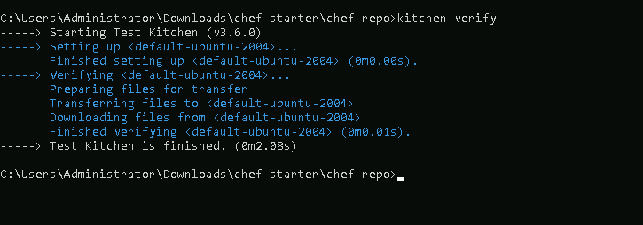

# **Using Chef's Community Cookbooks from Chef Supermarket**

## **Table of Contents**
---
* [**Description**](#description)  
* [**Problem Statement**](#problem-statement)  
* [**Prerequisites**](#prerequisites)
* [**Implementation Steps**](#implementation-steps) 
  - [**Step-1: Search for a Community Cookbook**](#step-1-search-for-a-community-cookbook) 
  - [**Step-2: Configure Test Kitchen**](#step-2-configure-test-kitchen) 
  - [**Step-3: Write InSpec Tests for the Cookbook**](#step-3-write-inspec-tests-for-the-cookbook) 
  - [**Step-4: Run Tests with Test Kitchen**](#step-4-run-tests-with-test-kitchen)
* [**References**](#references)

## **Description**
---
Chef Supermarket hosts a vast collection of **community cookbooks** contributed by Chef users worldwide, allowing users to reuse proven recipes for common configurations. These cookbooks reduce development time, providing pre-built configurations for services like Motd, Apache, MySQL, Nginx, and more.

## **Problem Statement**
---
Creating cookbooks from scratch for every new application or configuration can be time-consuming. By using **Chef Supermarket community cookbooks**, you can:
- Quickly provision common software and configurations.
- Customize existing configurations to suit specific requirements.
- Save time and effort by leveraging community-contributed resources.

## **Prerequisites**
---
Completion of all previous lab guides (up to Lab Guide-06) is required before proceeding with Lab Guide-07.

### **Software Required**
- **Chef Workstation**: To download, modify, and apply cookbooks.
- **Chef Server** or **Chef Client**: To upload and apply cookbooks in your environment.

### **Hardware Requirement**
- **Chef Workstation**: 2 GB RAM, 2 CPU cores

## **Implementation Steps**
---
### **Step-1: Search for a Community Cookbook**

**1. Search for the Cookbook**
  - To see a list of all community cookbooks available from Supermarket, run the following:

  ```bash
  knife supermarket list
  ```
  

  - Open the Chef Supermarket website: [Chef Supermarket](https://supermarket.chef.io)(Optional).  
  - Search for the **motd** cookbook.

**2. Download the Cookbook**
  - Run the following command on the Chef Workstation to download the cookbook:

  ```bash
  knife supermarket download motd
  ```
  

  - Extract the tar.gz file into cookbooks folder

  ```bash
  tar -xvf motd-0.6.0.tar.gz
  ```

**3. Verify Installation**
  - The cookbook will be downloaded to the `cookbooks` directory in your Chef repository. Verify the structure:
  ```bash
  ls chef-repo/cookbooks/motd
  ```

---

### **Step-2: Configure Test Kitchen**

**1. Initialize Test Kitchen:**  
   - Navigate to your Chef repository and initialize Test Kitchen:  
     ```bash
     kitchen init
     ```

**2. Edit `kitchen.yml`:**  
   Update the file to include the **motd** cookbook:  

```yaml
---
driver:
  name: vagrant

provisioner:
  name: chef_zero

platforms:
  - name: ubuntu-20.04

suites:
  - name: default
    run_list:
      - recipe[motd::default]
    attributes:
      motd:
        message: "Welcome to the Chef-Managed Server!"

```


### **Step-3: Write InSpec Tests for the Cookbook**

1. **Navigate to the Test Directory**:  
   ```bash
   cd test/integration/default
   ```

2. **Create a New InSpec Test**:  
   Write a test to validate that the `motd` package is installed and the service is running:  
  ```ruby
   # Ensure the /etc/motd file exists
  describe file('/etc/motd') do
    it { should exist }
    it { should be_file }
    its('content') { should match(/Welcome to your Chef-managed system!/) }
  end
  ```

---

### **Step-4: Run Tests with Test Kitchen**

1. **Create the Test Instance**:
     
    ```bash
    kitchen create
    ```

     

   - This command starts the container or virtual machine based on your `.kitchen.yml` configuration.

2. **Provision the Test Environment**:  
   Spin up a virtual machine and apply the cookbook:  
   ```bash
   kitchen converge
   ```

   

   


2. **Run InSpec Tests**:  
   Verify the cookbook’s behavior:  
   ```bash
   kitchen verify
   ```

   

3. **Destroy the Test Environment**:  
   Once testing is complete, clean up:  
   ```bash
   kitchen destroy
   ```

   

4. **Upload the Cookbook to Chef Server**:  
   Push the validated cookbook to the Chef server:  
   ```bash
   knife cookbook upload motd 
   ```

   

---

## **References**
---
1. **Chef Supermarket Documentation**: [https://supermarket.chef.io](https://supermarket.chef.io)  
2. **Test Kitchen Documentation**: [https://kitchen.ci/](https://kitchen.ci/)  
3. **Chef InSpec Documentation**: [https://www.chef.io/products/chef-inspec](https://www.chef.io/products/chef-inspec)  
4. **Chef Official Documentation**: [https://docs.chef.io/](https://docs.chef.io/)  


