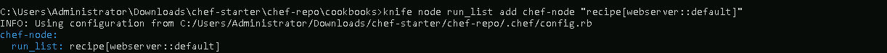

# **Create custom resources in Chef and use them in your recipes**

## **Table of Contents**
---
* [**Description**](#description)  
* [**Problem Statement**](#problem-statement)  
* [**Prerequisites**](#prerequisites)
* [**Implementation Steps**](#implementation-steps) 
  - [**Step-1: Define the Custom Resource**](#step-1-define-the-custom-resource) 
  - [**Step-2: Use the Custom Resource in a Recipe**](#step-2-use-the-custom-resource-in-a-recipe) 
* [**References**](#references)

## **Description**
---
Custom resources in Chef allow you to package reusable code for frequently performed tasks. By defining custom resources, you can encapsulate logic and actions, making Chef recipes more modular and maintainable. This guide demonstrates how to create a custom resource that installs and configures a web server, and how to use it in your Chef recipes.

## **Problem Statement**
---
When managing multiple configurations or systems, it becomes difficult to maintain and replicate complex configurations. Using Chef's custom resources, you can:
- Modularize configuration logic.
- Reuse resources across multiple recipes.
- Standardize configurations.

## **Prerequisites**
---
Completion of all previous lab guides (up to Lab Guide-08) is required before proceeding with Lab Guide-09.

### **Software Required**
- **Chef Workstation**: To create and test the custom resource and recipe.
- **Chef Infra Client**: To apply the configuration.

### **Hardware Requirement**
- A **Chef Workstation** with internet access for downloading dependencies.

## **Implementation Steps**
---
### **Step-1: Define the Custom Resource**

1. **Create a Directory for the Resource**:
   Inside your Chef cookbook, create a directory named `resources`.

   ```bash
   mkdir -p cookbooks/webserver/resources
   ```

   

2. **Define the Custom Resource**:
   Create a Ruby file in the `resources` directory. This example shows a resource that installs a web server, configures a document root, and starts the server.

   #### File: `cookbooks/webserver/resources/webserver.rb`

   ```ruby
   # Custom Resource: webserver
   provides :webserver

   property :package_name, String, default: 'apache2'   # For installing the server
   property :doc_root, String, default: '/var/www/html'  # Default document root

   action :install do
     package new_resource.package_name do
       action :install
     end

     directory new_resource.doc_root do
       action :create
       recursive true
     end
   end

   action :start do
     service new_resource.package_name do
       action [:enable, :start]
     end
   end
   ```

   In this example:
   - **`property :package_name`** and **`property :doc_root`** define configurable parameters.
   - **`:install`** and **`:start`** are actions that will be performed by the custom resource.

   

3. **Define a Default Action**:
   By setting a default action, you control which action runs if none is specified.

   ```ruby
   default_action :install
   ```

### **Step-2: Use the Custom Resource in a Recipe**

Once the custom resource is defined, you can use it in any recipe in the same cookbook or from other cookbooks that include this one.

1. **Create a Recipe File**:
   Inside your `recipes` directory, create a recipe that uses the `webserver` custom resource.

   #### File: `cookbooks/webserver/recipes/default.rb`

   ```ruby
   # Using the webserver custom resource

   webserver 'Install and Configure Web Server' do
     package_name 'apache2'       # Replace with the desired web server package name
     doc_root '/var/www/my_site'  # Replace with the desired document root
     action :install
   end

   webserver 'Start Web Server' do
     action :start
   end
   ```

   In this example:
   - **First Block**: Installs and configures the web server by setting the package name and document root.
   - **Second Block**: Starts the web server.

   

2. **Upload cookbook**

   ```bash
   knife cookbook upload webserver
   ```

   

   ```bash
   knife node run_list add chef-node "recipe[webserver::default]"
   ```

   

2. **Run the Recipe**:
   Apply the recipe to a node to verify the custom resource works as expected:

   ```bash
   sudo chef-client
   ```

   

3. **Verify the Web Server**:
   Confirm that the web server is installed, running, and accessible. Check that the document root is created at the specified path.

   ```bash
   sudo systemctl status apache2
   ```

   

   

## **References**
---
- [Chef Custom Resources Documentation](https://docs.chef.io/custom_resources/)
- [Chef Properties and Attributes](https://docs.chef.io/resources/)
