# **Integrate Chef with a CI/CD pipeline for automated deployments**

## **Table of Contents**
---
* [**Description**](#description)  
* [**Problem Statement**](#problem-statement)  
* [**Prerequisites**](#prerequisites)
* [**Implementation Steps**](#implementation-steps) 
  - [**Step 1: Install Jenkins Using Docker**](#step-1-install-jenkins-using-docker) 
  - [**Step 2: Create a Windows Agent in Jenkins**](#step-2-create-a-windows-agent-in-jenkins)
  - [**Step 3: Start the Jenkins Agent on the Windows Node**](#step-3-start-the-jenkins-agent-on-the-windows-node)
  - [**Step 4: Create and Configure Credentials in Jenkins**](#step-4-create-and-configure-credentials-in-jenkins)
  - [**Step 5: Add CHEF_WORKSTATION_PATH as a Global Environment Variable**](#step-5-add-chef_workstation_path-as-a-global-environment-variable)
  - [**Step 6: Run the Pipeline**](#step-6-run-the-pipeline) 
  - [**Step-7: Update and Configure `knife.rb` for Jenkins Pipeline**](#step-7-update-and-configure-kniferb-for-jenkins-pipeline) 
* [**References**](#references)


## **Description** 
---
Integrating Chef with a CI/CD pipeline allows automated testing, configuration, and deployment of infrastructure changes. In this guide, you will configure a CI/CD pipeline using Chef to manage infrastructure and application deployment. This setup provides a consistent, testable approach to infrastructure provisioning and deployment.

## **Problem Statement**
---
When managing infrastructure across environments, manual configurations can lead to inconsistencies. Automating deployment with Chef and integrating it into a CI/CD pipeline solves these issues by:
- Testing and validating configuration changes automatically.
- Applying configurations consistently across environments.
- Reducing human error in repetitive tasks.

## **Prerequisites**
---
Completion of all previous lab guides (up to Lab Guide-09) is required before proceeding with Lab Guide-10.

### **Software Required**
- **Chef Workstation**: To write and test Chef configurations.
- **Chef Server**: For managing node configurations.
- **Docker**: For installing Jenkins.
- **Jenkins or another CI/CD tool**: To set up automated testing and deployment.
- **Git**: For version control and Chef cookbook management.

### **Hardware Requirement**
- **Chef Server**: 4 GB RAM, 2 CPU cores minimum.
- **Workstation**: 4 GB RAM, 2 CPU cores minimum.
- **CI/CD Server** (e.g., Jenkins): 8 GB RAM, 4 CPU cores recommended.

## **Implementation Steps**
---
### **Step 1: Install Jenkins Using Docker**

**1. Create Docker Network:**

* Create a Docker network named "`jenkins`" to allow communication between containers.

  ```docker
  docker network create jenkins
  ```

**2. Run Docker Daemon Exposed with Port 2376:**

* Start a Docker daemon with necessary configurations for Jenkins usage.

  ```docker
  docker run --name jenkins-docker --rm --detach ^
  --privileged --network jenkins --network-alias docker ^
  --env DOCKER_TLS_CERTDIR=/certs ^
  --volume jenkins-docker-certs:/certs/client ^
  --volume jenkins-data:/var/jenkins_home ^
  --publish 2376:2376 ^
  docker:dind
  ```

**3. Run Jenkins Image:**

* Start Jenkins container using a custom image or the official Jenkins image, ensuring it's properly configured.

  ```docker
  docker run --name jenkins-blueocean --restart=on-failure --detach ^
  --network jenkins --env DOCKER_HOST=tcp://docker:2376 ^
  --env DOCKER_CERT_PATH=/certs/client --env DOCKER_TLS_VERIFY=1 ^
  --volume jenkins-data:/var/jenkins_home ^
  --volume jenkins-docker-certs:/certs/client:ro ^
  --publish 8080:8080 --publish 50000:50000 vijaynvb/jenkins:1.0
  ```

- Open a browser and navigate to `http://localhost:8080`. 

**Setup admin details**

- Access the jenkins application in `localhost:8080`
- Login with default credentials - To get the `password` , go to the shown directory or simply run `docker logs containerId` & get the password from logs.

  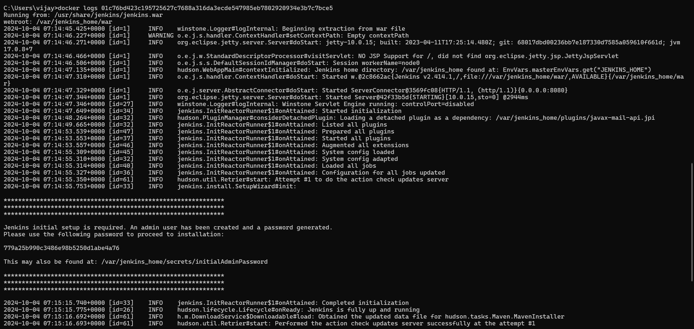

- copy the password from console paste it in login page.  

  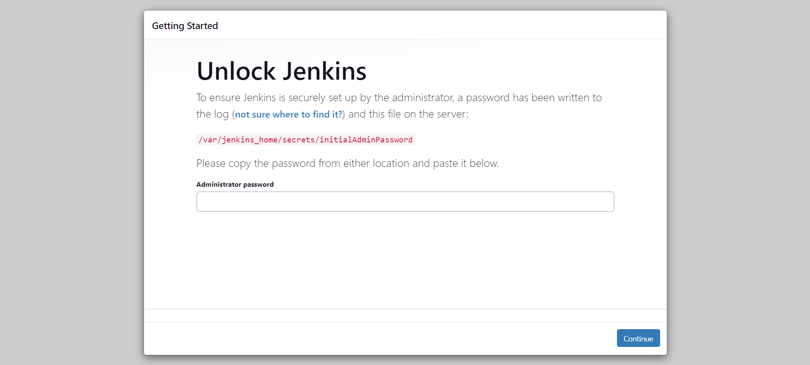

- Select `Install suggested plugins`

  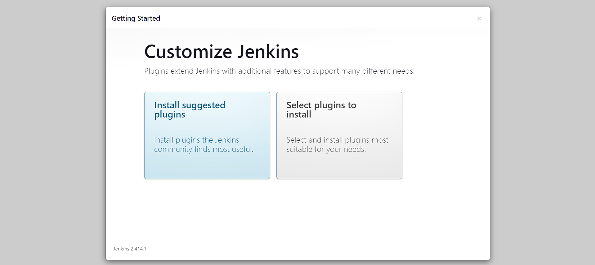

- Create new user 'administrator' with password '**\*\*\*\***'

  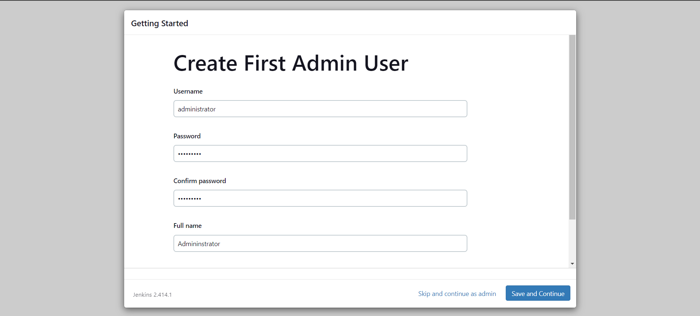

- Save and Continue


### **Step 2: Create a Windows Agent in Jenkins**


1. **Go to Manage Jenkins**:
   - On the Jenkins dashboard, click **Manage Jenkins**.

   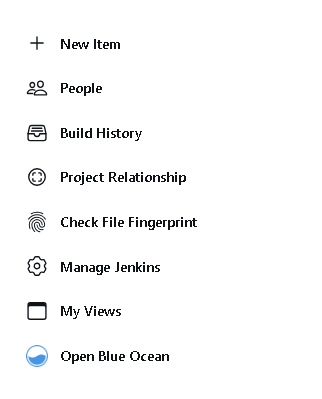
   
2. **Go to Manage Nodes**:
   - Scroll down and click **Nodes** (or **Manage Nodes and Clouds**).

   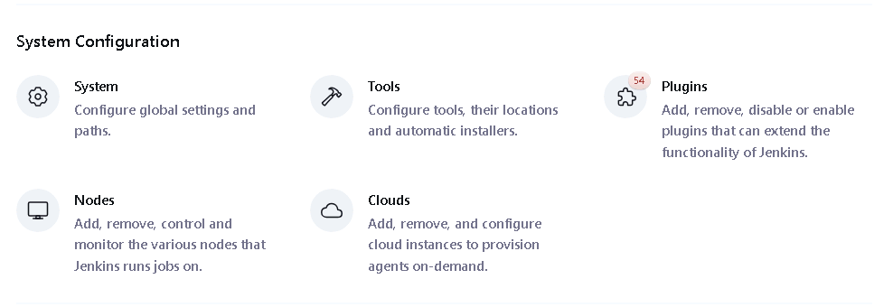
   

3. **Create New Node**:
   - Click **New Node** on the left sidebar.
   - Give the node a name (e.g., `windows-node`).
   - Select **Permanent Agent** and click **OK**.

   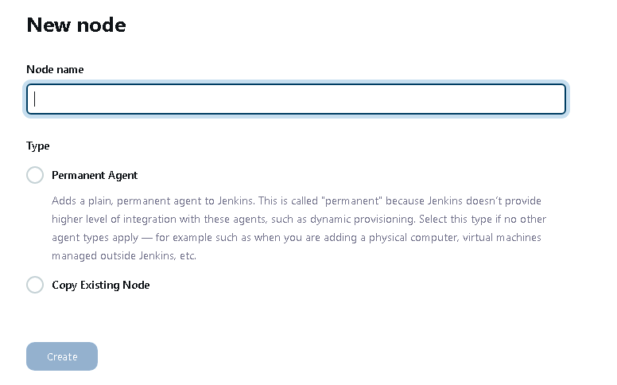

4. **Configure the Windows Node**:
   - **Description**: Add an optional description.
   - **# Executors**: Set the number of executors (typically `1`).
   - **Remote Root Directory**: Set the directory where Jenkins stores the workspace (e.g., `C:\jenkins`).
   - **Labels**: Add a label (e.g., `windows`) to easily reference the node in your pipeline.
   - **Launch Method**: 
     - Select **Launch agent by connecting it to the controller

  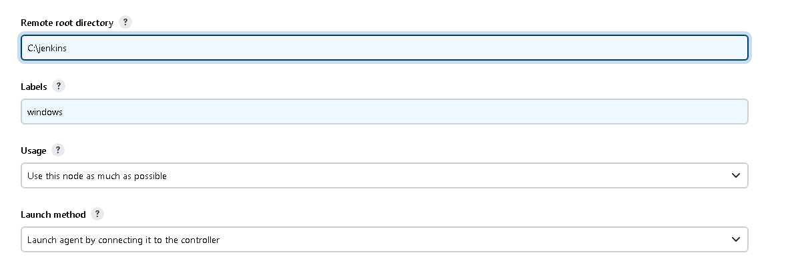   

5. **Save** the configuration.

### **Step 3: Start the Jenkins Agent on the Windows Node**

1. Click on the **windows-node**
  
  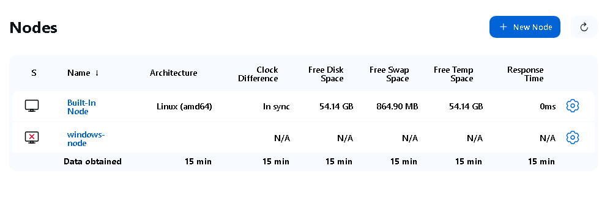

2. **Run the Jenkins Agent on Windows**:
   - Open **Command Prompt** (CMD) on the Windows node.
   - Copy the command from **Run from agent command line (Windows)** and run it in the windows **Command Prompt**.

   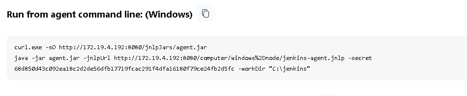

   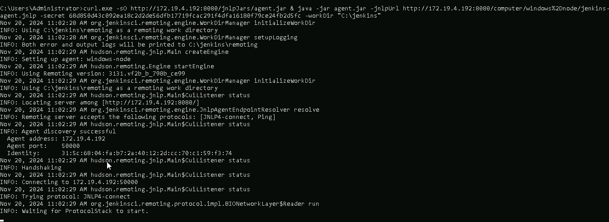

3. **Verify Connection**:
   - After running the command, the Jenkins agent should connect to the Jenkins master.
   - The node will show as **online** on the **Manage Nodes** page in Jenkins.


### **Step 4: Create and Configure Credentials in Jenkins**

#### 4.1 Add Chef Server Credentials
- Go to **Manage Jenkins > Credentials > System > Global Credentials>Add Credentials**.

  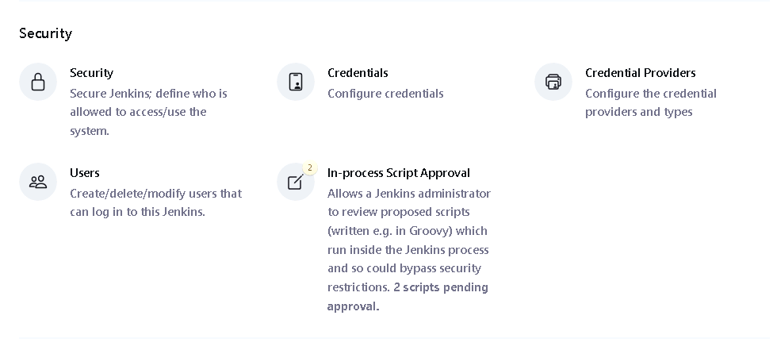

  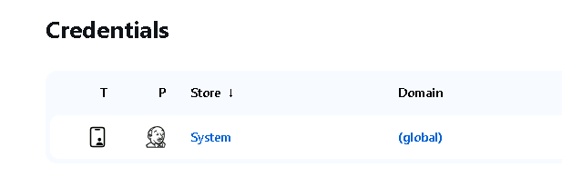

  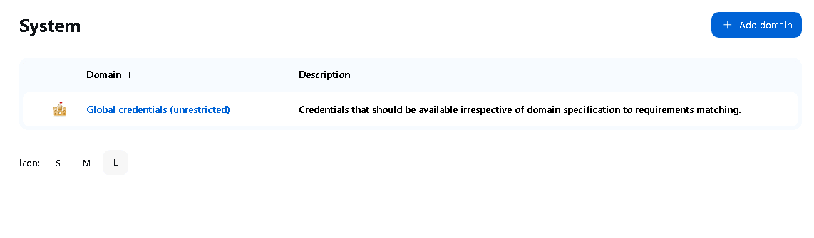

  

- Add a new credential:
  - **ID**: `chef-server-id`
  - **Username**: Chef Server username
  - **Password**: Chef Server password

  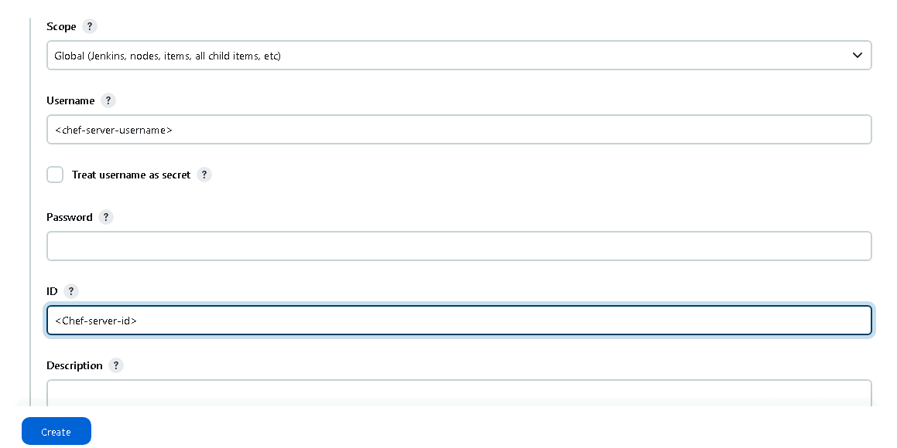

### **Step 5: Add CHEF_WORKSTATION_PATH as a Global Environment Variable**

#### 5.1 Configure Global Properties
- Navigate to **Manage Jenkins > Configure System**.  

 

- Enable **Global Properties > Environment Variables**.  
- Add the following variable:
  - **Name**: `CHEF_WORKSTATION_PATH`
  - **Value**: `C:/opscode/chef-workstation/bin`

  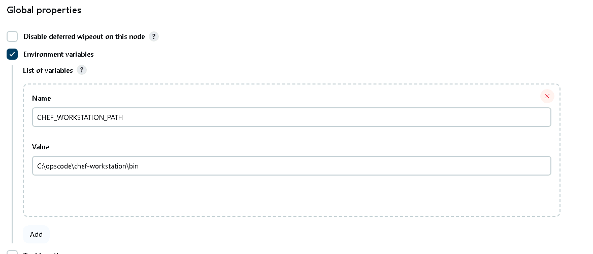

---

### **Step 6: Run the Pipeline**

Once the agent is online, you can use the node in your pipeline as follows:

- Create a Pipeline

  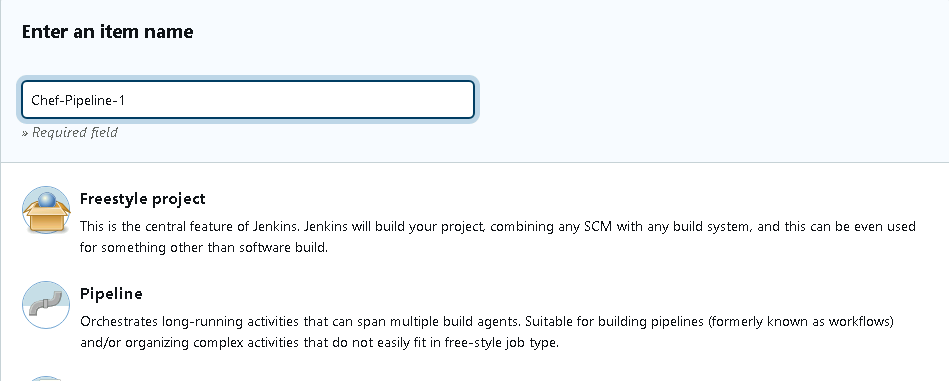

- Add the pipeline struture as shown below.

- Click on **Apply** and **Save** the configurtion.

- Click on **Build Now** ro run the pipeline.

```groovy
pipeline {
    agent { label 'windows' } // Ensure the pipeline runs on a Windows agent

    environment {
        CHEF_SERVER_CRED = credentials('sooryav') // Jenkins credential ID for Chef server
        CHEF_ORG = 'chefserver02' // Chef organization name
        CHEF_NODE_IP = '172.19.3.101' // Target node IP (Ubuntu node)
        CHEF_NODE_USER = 'vagrant' // Node SSH username
        CHEF_NODE_PASS = 'vagrant' // Node SSH password
        CHEF_WORKSTATION_PATH = "C:/opscode/chef-workstation/bin" // Chef Workstation path on Windows
        CHEF_LOCAL_PATH = "C:/Users/Administrator/Downloads/chef-starter/chef-repo" // Local Chef folder path
        PATH = "${env.CHEF_WORKSTATION_PATH};${env.PATH}" // Add Chef Workstation path to the PATH
    }

    stages {
        stage('Use Local Chef Repository') {
            steps {
                echo 'Using local Chef repository...'
                bat """
                echo Copying Chef repository from local path...
                xcopy /E /I /Y "${CHEF_LOCAL_PATH}" "%WORKSPACE%\\chef-repo"
                """
            }
        }

        stage('Upload Cookbooks') {
            steps {
                echo 'Uploading cookbooks to Chef server...'
                bat """
                %CHEF_WORKSTATION_PATH%/knife cookbook upload webserver --config %WORKSPACE%\\chef-repo\\.chef\\knife.rb --cookbook-path %WORKSPACE%\\chef-repo\\cookbooks
                """
            }
        }
    }

    post {
        success {
            echo 'Pipeline executed successfully! Chef configurations are applied and verified.'
        }
        failure {
            echo 'Pipeline execution failed. Check the logs for detailed error information.'
        }
    }
}

```
- Check the pipeline status on **Console output**.

  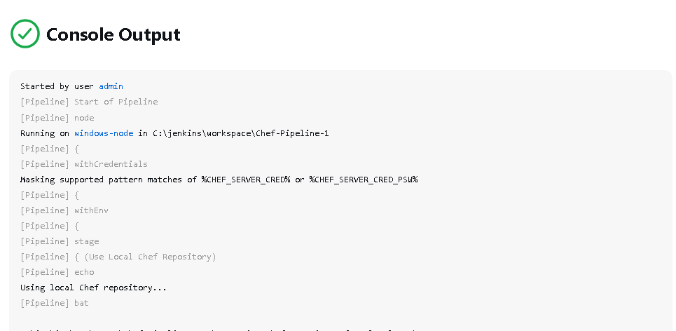

- The pipeline begins by cloning the Chef repository from GitHub into the Jenkins workspace.
- Upload the `webserver` cookbook to the Chef server using `knife`.  

### **Step-7: Update and Configure `knife.rb` for Jenkins Pipeline**

To fix the `knife not found` error, you need to rename your `config.rb` file to `knife.rb` and ensure it is configured properly to work with the Jenkins pipeline structure. Below are the steps:

---

### **Steps to Configure `knife.rb`**
1. **Locate the `config.rb` File**:
   - Navigate to the directory where `config.rb` is located. Typically, it will be in the `.chef` folder within your Chef repository.

   ```bash
   cd C:/Users/Administrator/Downloads/chef-starter/chef-repo/.chef
   ```

2. **Rename `config.rb` to `knife.rb`**:
   - Rename the `config.rb` file using the command:

   ```bash
   ren config.rb knife.rb
   ```

3. **Update `knife.rb` Configuration**:
   - Open the renamed `knife.rb` file in an editor (like Notepad++ or VS Code) and update it to work with your Jenkins pipeline structure:

     ```ruby
     # Knife configuration for Jenkins pipeline
     current_dir = File.dirname(__FILE__)
     log_level                :info
     log_location             STDOUT
     node_name                "sooryav"
     client_key               "#{ENV['WORKSPACE']}\\chef-repo\\.chef\\sooryav.pem"
     chef_server_url          "https://api.chef.io/organizations/chefserver02"
     cookbook_path            ["#{ENV['WORKSPACE']}\\chef-repo\\cookbooks"]
     ```

## **References**
---
1. **Chef Official Documentation**: [https://docs.chef.io/](https://docs.chef.io/)  
2. **Jenkins Official Documentation**: [https://www.jenkins.io/](https://www.jenkins.io/)  
3. **Docker Documentation**: [https://docs.docker.com/](https://docs.docker.com/)  
4. **GitHub Repository Setup**: [https://github.com/](https://github.com/)  
